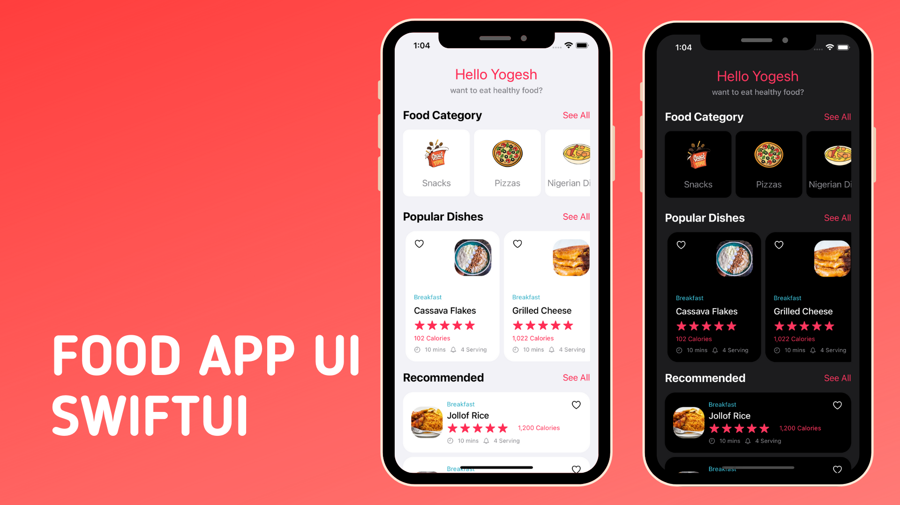

# YUMMIE Food Delivery App: Home Page UI with SwiftUI

## Project Overview
- I developed this project using SwiftUI, MVVM, Combine, and integrated it with Yummie's backend for data.
- On the home screen, you'll find a list of Food Categories, popular dishes, and our best recommendations.
Soon, 
- I'll be adding a details screen where you can view the title, image, and description of a selected dish, as well as an intuitive UI to place an order. Stay tuned for updates!

